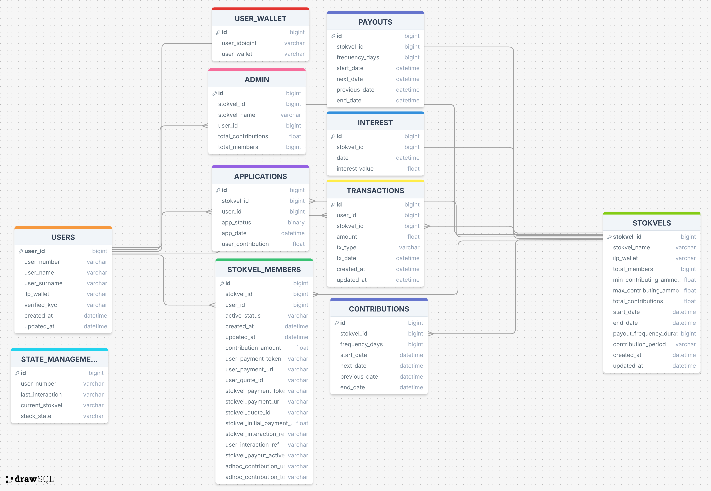

### Introduction

This project utilizes a SQLite database to build and manage data storage, focusing on scalability and flexibility. The design ensures efficient data handling for stokvel members, transactions, contributions, and payouts.

### Design Overview

While foreign key relationships were defined between various tables to maintain logical data structures, these relationships are not currently enforced by SQLite. This is a limitation of the existing design, and future updates will aim to implement foreign key enforcement to ensure referential integrity across the system.

### Foreign Key Relationships

Although foreign key relationships were set up in the table design, they are not enforced at the database level. Enforcing these relationships in future iterations will be essential to prevent orphaned records and to maintain the integrity of relationships between entities (e.g., **USERS**, **STOKVELS**, **TRANSACTIONS**). This step will enhance the data reliability as the system continues to develop.

## Tables and Relationships

The entity diagram below provides a visual representation of the database structure and the relationships between different tables. It highlights how various entities (tables) are interconnected through foreign key relationships, ensuring that data integrity and logical associations are maintained throughout the system.

Each table in the diagram represents a specific entity, such as Users, Stokvels, or Transactions, with lines connecting these tables to illustrate their relationships. For example, the STOKVEL_MEMBERS table links users to specific stokvels by associating user IDs with stokvel IDs, demonstrating a many-to-many relationship.

By understanding this diagram, you can see how the data flows and interacts across the system, which is crucial for ensuring efficient data management and integrity. This visual overview helps to quickly identify key components and how they connect, making it easier to navigate and understand the database's design.

