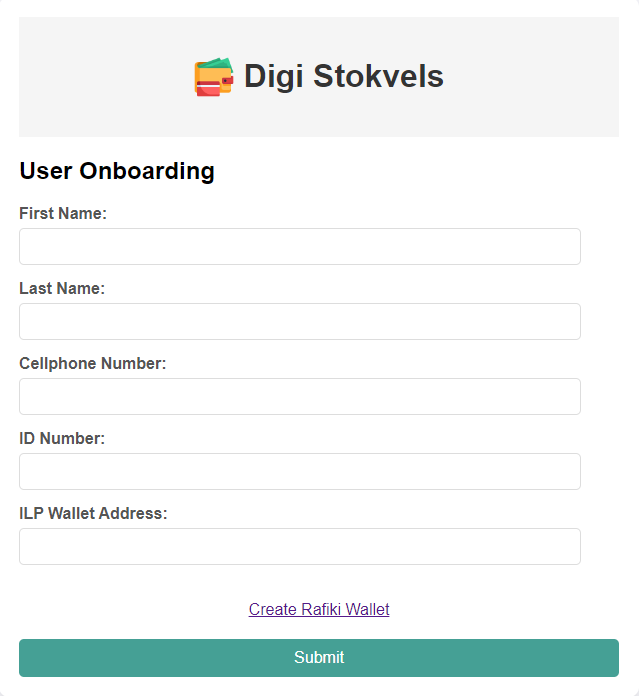

# Why We Use Flask Templates

The use of Flask templates allows us to handle more complex user interactions that would be challenging to manage solely through the WhatsApp interface. While WhatsApp is an effective tool for simple, text-based communication and quick actions, it has limitations when dealing with forms that require multiple fields, user input validation, and more intricate user experiences. Here are a few key reasons:

**Complex User Inputs**:

  - **Forms with Multiple Fields**: Managing complex forms, such as updating user details or editing a stokvel's information, is more intuitive and streamlined through a web-based interface. Flask templates enable us to build forms that can include various input types, offer field validation, and provide detailed feedback, which would be cumbersome through a chat interface.
  - **Data Validation**: Flask allows for real-time data validation, ensuring users receive immediate feedback if they enter invalid information. On WhatsApp, this process would be less fluid, requiring multiple back-and-forth messages to correct user input errors.

**Enhanced User Experience**:

  - **Visual Feedback and Structure**: Unlike WhatsApp, which relies purely on text and simple buttons, a web interface built with Flask templates can provide a richer experience with visual cues, structured forms, and a more intuitive layout. This improves the user experience by guiding users through processes like updating details or managing group settings.
  - **Security**: Complex actions, such as updating passwords, are best handled through a secure web environment that can properly encrypt and manage user credentials. Flask templates allow for the secure handling of sensitive data inputs, ensuring a safer interaction compared to a more constrained platform like WhatsApp.

**Integration with Backend Logic**:

  - **Direct Integration**: Flask templates can directly interact with backend systems, making it easier to perform actions like form submissions, data processing, and user authentication. This integration streamlines the user experience, ensuring that inputs are processed quickly and accurately without the need for multiple steps.

By using Flask templates, we can provide users with an enhanced, efficient, and secure way to perform complex tasks that go beyond what is feasible within a simple messaging app. This combination of a rich web interface for more intricate interactions and WhatsApp for quick and straightforward communication creates a balanced user experience, making the DigiStokvel platform both versatile and user-friendly.

## Onboarding Template

The `onboarding_template` page serves as a guide for new users to help them sign up and set up their accounts. It collects basic information like name, email, and password and may offer additional options to customize the user experience.

**Data Captured:**

- **Full Name**: A required field to capture the user's full name, which will be used to personalize the account and communication.
- **Email Address**: A required field to capture the user's email, which must follow a valid email format. The email is used for communication and account management.
- **Password**: A required field for account security. Password complexity rules may be enforced to ensure strong security.
- **Preference Settings**: Optional fields that allow the user to customize their experience (e.g., notification settings, group suggestions).

**Why the Onboarding Template page is designed so:**
Onboarding is critical for user retention and ensuring a smooth first experience. By guiding new users through account setup, the page ensures that users can easily get started with the system. It simplifies the sign-up process while capturing essential information needed for creating an account. The optional customization settings enhance the user experience by tailoring the platform to the user's preferences right from the start.

**Endpoints in Onboarding Template:**
**POST /onboarding**:

  - The form data is sent to the backend (`onboarding.py`), where it is validated for accuracy and completeness.
  - The backend checks for duplicate emails and verifies that the password meets the security requirements.
  - If the validation is successful, the user's account is created in the database, and they are logged into the system.
  - If there are any issues, such as a duplicate email or password weakness, appropriate error messages are displayed to guide the user in fixing the problem.

## Stokvel Creation Template

The `stokvel_creation_template` page allows users to create a new stokvel group by providing basic details such as the group's name, its purpose, and the initial list of members. The page is designed to streamline the process of starting a stokvel.

**Data Captured:**

- **Group Name**: A required field that captures the name of the new stokvel group.
- **Purpose**: A description field that outlines the purpose or goal of the group. This helps new members understand what the group is about.
- **Initial Members**: A list of people to be invited or added as founding members of the stokvel.

**Why the Stokvel Creation Template page is designed so:**
This page is designed to encourage users to create new stokvels by providing a simple and straightforward process. Group creation needs to be intuitive to lower the barrier for entry, and the page achieves this by minimizing the number of required fields while still capturing essential details. The ability to invite or add initial members during creation also fosters early group collaboration.

**Endpoints in Stokvel Creation Template:**
**POST /create_stokvel**:

  - The form data is processed by `create_stokvel.py`, where the backend validates the group name to ensure uniqueness.
  - The backend also ensures that required fields (e.g., group name and purpose) are filled out correctly.
  - If the validation is successful, the new stokvel is created in the database, and the initial members are notified of their inclusion.
  - If there are any issues, such as a duplicate group name, an error message is returned to the user for correction.

## Joining Template

The `joining_template` page allows users to submit a request to join an existing stokvel. The page collects the user's basic information and, optionally, a message explaining why they want to join the group.

**Data Captured:**

- **User Information**: The user's name and email address.
- **Reason for Joining**: An optional field where the user can explain their motivation for joining the group. This is particularly useful for stokvels that have specific membership criteria.

**Why the Joining Template page is designed so:**
This page formalizes the process of joining a stokvel, ensuring that administrators receive all the necessary information to make informed decisions about membership. The optional reason-for-joining field helps administrators understand the user's motivations and decide whether they are a good fit for the group.

**Endpoints in Joining Template:**
**POST /join_stokvel**:

  - The form data is processed by `join_stokvel.py`, which submits the user's request to the stokvel administrator.
  - The system checks for potential issues (e.g., duplicate requests) before submitting the application.
  - Upon successful submission, the user is notified that their request has been sent. The stokvel admin will then review the application and decide whether to accept or reject it.

## Approve Applications

The `approve_applications` page is designed for stokvel administrators to manage membership requests. Administrators can view pending applications and either approve or reject them based on the details provided by the applicants.

**Data Captured:**
- **Pending Applications**: A list of pending membership requests is displayed, including each applicant's name, email, and reason for joining (if provided).

**Why the Approve Applications page is designed so:**
This page is essential for stokvel management. It provides a simple and intuitive interface for administrators to view and manage applications, ensuring that the group's membership is carefully controlled. By reviewing the reasons for joining, administrators can maintain the integrity of the group and ensure that new members align with the group's purpose.

**Endpoints in Approve Applications:**
**POST /approve_application**:

  - The administrator's decision (approve or reject) is sent to `approve_applications.py`, where the backend updates the status of the application in the database.
  - If the application is approved, the user is notified and added to the group. If rejected, the user is informed of the decision.
  - The page may also allow administrators to leave a note explaining their decision, particularly if the application is rejected.

## Action Success Template

The `action_success_template` page is a generic confirmation page that informs users that their requested action has been successfully completed. It is commonly used after form submissions or updates, providing a clear indication that the user's request was processed without errors.

**Data Captured:**
- No specific data is captured on this page. It simply displays a success message.

**Why the Action Success Template page is designed so:**
Feedback is crucial for user experience. After completing an action (e.g., submitting a form or updating a profile), users need to know that their request was successful. The `action_success_template` provides this confirmation, ensuring that users are aware that their action was processed as expected.

**Endpoints in Action Success Template:**
**GET /action_success**:

  - This endpoint displays the success message after a user completes a specific action, such as submitting a form or making an update. It is designed to provide positive feedback and closure to the user's interaction.

## Action Failed Template

The `action_failed_template` page notifies users that an action they attempted has failed, usually due to a validation error or system issue. This page is designed to help users understand what went wrong and how they can correct it.

**Data Captured:**

- No specific data is captured on this page. It simply displays an error message with guidance on how to resolve the issue.

**Why the Action Failed Template page is designed so:**

- When something goes wrong, users need clear feedback to understand the problem and how to fix it. The `action_failed_template` page provides this feedback, helping users correct errors and retry their actions. It improves user experience by providing clear guidance on next steps.

**Endpoints in Action Failed Template:**
**GET /action_failed**:

  - This endpoint displays an error message when the user's action fails. It could be triggered by form validation failures, incorrect login attempts, or issues processing a request. The page offers guidance on how the user can resolve the issue or retry the action.

