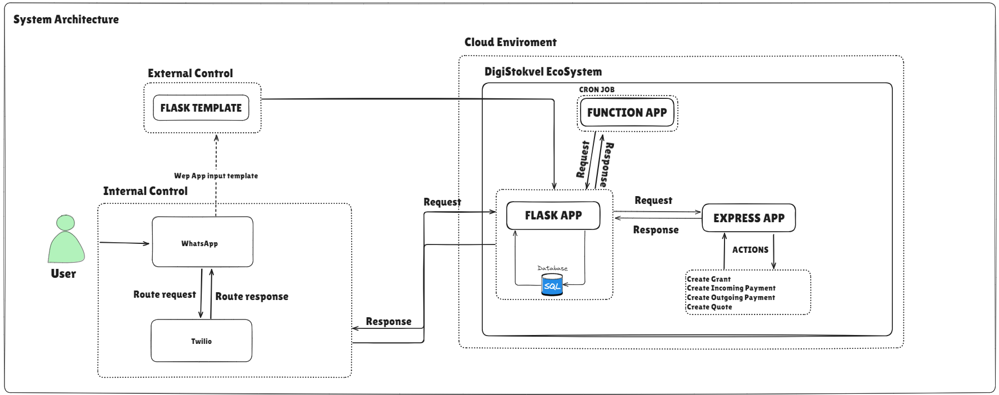

The system architecture diagram illustrates how different components of the DigiStokvel ecosystem interact to handle user requests and manage stokvel operations.

Here's a breakdown of the architecture and the flow of interactions:

### Components Overview

**User**:

- Represents the end user interacting with the DigiStokvel system. Users primarily engage with the system via WhatsApp.

**Internal Control**:

- **WhatsApp**: Users send and receive messages via WhatsApp. This serves as the primary interface for internal control, where users can perform actions like making contributions, requesting payouts, or querying stokvel information.
- **Twilio**: This service routes messages between WhatsApp and the backend systems. It helps manage the communication channel, ensuring that requests from users are properly routed and responses are sent back.

**External Control**:

- **Flask Template**: Users may need to interact with a web-based form or interface outside the WhatsApp environment. This template is used when users need to perform actions that require leaving the WhatsApp system, such as filling out detailed forms or accessing specific web functionalities.

**Cloud Environment (DigiStokvel EcoSystem)**:

- **Flask App**: This serves as the core backend application. It handles incoming requests from the user, processes them, and interacts with the SQLite database. The Flask app manages the main business logic of the DigiStokvel system.
- **Express App**: Responsible for handling specific actions such as creating grants, processing incoming/outgoing payments, and generating quotes. It communicates with the Flask app via HTTP requests, responding to requests and sending back the necessary information or actions.
- **Function App**: Operates as a serverless function that can be triggered by specific events or run on a schedule (e.g., via cron jobs). It handles background tasks and automation, such as running the daily cron job to process any scheduled payments or contributions. It communicates with the Flask app for processing these tasks.

**Database (SQLite)**:

- The SQLite database stores all the information related to users, stokvels, transactions, contributions, and other system data. The Flask app interacts with this database to fetch and update information as required.

### Flow of Interactions

**Internal Control Flow**:

- Users interact with the system via **WhatsApp**, sending requests (e.g., to contribute to a stokvel or request information).
- **Twilio** acts as the gateway, routing the requests to the **Flask App**.
- The **Flask App** processes the request, interacts with the **SQLite Database** to fetch or update data, and sends the appropriate response back through **Twilio**, which then returns the response to the user via **WhatsApp**.
- This ensures that users remain within the WhatsApp environment for these interactions, keeping them in "internal control."

**External Control Flow**:

- If the user needs to perform an action that requires a more complex interface (e.g., filling out a form), they are directed to the **Flask Template**, which provides a web-based interface. This action falls under "external control" because the user must leave the WhatsApp environment.
- Once the required action is completed, the user can return to the WhatsApp interface to continue engaging with the system.

**Background Processing**:

- The **Function App** manages tasks that need to be executed automatically, such as processing contributions and payouts. A **cron job** runs every day, triggering the **Function App** to check for any scheduled payments.
- The **Function App** sends requests to the **Flask App** to execute these payments, which may involve creating records in the **SQLite Database** and communicating with the **Express App** to handle payment actions.
- The **Express App** executes specific actions like creating grants or processing payments based on requests from the **Flask App** and sends the appropriate response back.

The architecture effectively integrates multiple components, providing seamless user interactions via WhatsApp, automating regular tasks through cron jobs, and managing business logic and data processing through Flask and Express applications. The division between internal and external control helps streamline the user experience, ensuring smooth interactions within the WhatsApp environment while supporting external activities when necessary. The automated **Function App** ensures that daily operations like payments and contributions are processed without manual intervention, enhancing system efficiency.